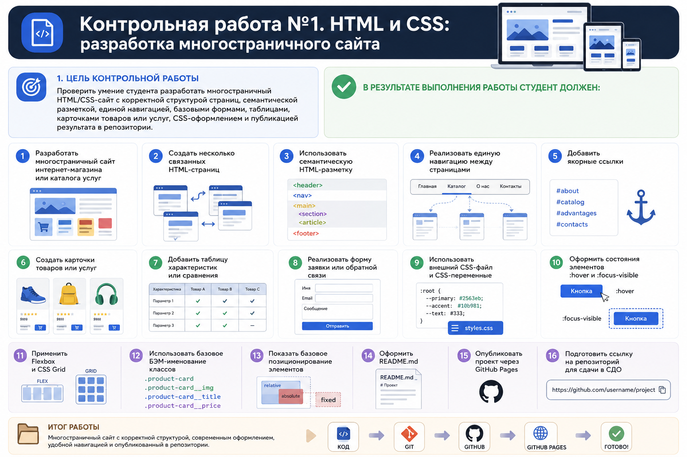

# Фронтенд и бэкенд разработка

## Контрольная работа №1. HTML и CSS: разработка многостраничного сайта

### Цель работы

Проверить умение студента разработать многостраничный HTML/CSS-сайт с корректной структурой страниц, семантической разметкой, единой навигацией, базовыми формами, таблицами, карточками товаров или услуг, CSS-оформлением и публикацией результата в репозитории.

### О проекте

Данный сайт представляет собой многостраничный магазин винтажной/редкой одежды.

### Что реализовано

- Многостраничность (главная, каталог, страница товара, о магазине, контакты)
- Единая навигация между страницами
- Семантическая разметка (`header`, `nav`, `main`, `section`, `article`, `footer`, `address`)
- Якорные ссылки (блок преимуществ на главной)
- Карточки товаров в каталоге
- Таблица размеров на странице товара
- Форма обратной связи
- Внешний CSS-файл и CSS-переменные
- Flexbox (каталог, меню) и Grid (страница товара)
- БЭМ-именование классов
- Состояния `:hover` и `:focus-visible`
- Позиционирование (бейдж «Новинка» через `relative`/`absolute`)

С полным списком требований можно ознакомиться на скриншоте:



## Структура проекта

```
kr1-html-shop/
├── index.html      — главная
├── catalog.html    — каталог товаров
├── product.html    — страница товара
├── about.html      — о магазине
├── contacts.html   — контакты и форма
├── css/
│   └── style.css   — стили
└── img/            — изображения
```

## Как запустить

1. Склонировать репозиторий: `git clone https://github.com/kiyoushii/fib-3sem.git`
2. Открыть `kr1-html-shop/index.html` в браузере
   (или запустить через расширение Live Server в VS Code)

## Демо

Сайт: https://kiyoushii.github.io/fib-3sem/kr1-html-shop/index.html
